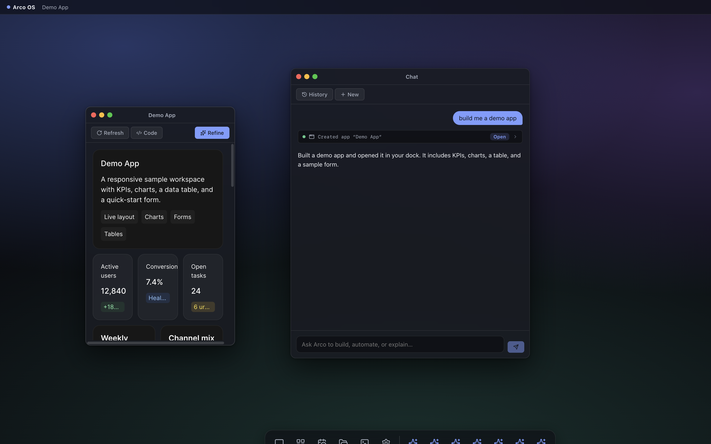

# Arco OS

A generative AI operating system prototype. A desktop shell in the browser where an agent builds live, adaptive apps on demand — combining a windowed OS experience, a generative UI pipeline, and coding/automation agent capabilities.



## What it does

- **Desktop shell** — draggable/resizable windows, menu bar, dock, notifications, light/dark themes, persisted window layouts. Small viewports automatically switch to a full-screen mobile shell.
- **Agent chat** — a streaming chat agent with visual tool-call cards. Ask it to build apps, run shell commands, manage files, query databases, or schedule automations.
- **Generative apps** — the agent writes apps in OpenUI Lang (a small declarative UI DSL). Apps are persisted with version history, appear in the dock, and render live data via direct tool calls (no LLM round-trip).
- **Adaptive UIs** — every generated app reflows to its container: row layouts stack in narrow windows, charts resize fluidly, and the same app works from a phone-width panel to a full display. Driven by `ResizeObserver` + container-size attributes + CSS overrides.
- **Coding tools** — sandboxed workspace with `exec`, file read/write/list, and an in-OS Terminal and Files app.
- **Databases** — namespaced SQLite databases usable by both the agent and generated apps.
- **Automations** — cron-scheduled agent runs with prompts, run history, and an Automations manager app.
- **Accounts & locking** — boot splash → login flow, session auth on every API route, role-based permissions (owner/admin/member/viewer), manual + idle lock screen, and in-app account management.

## Quick start

Requires Node 22+.

```bash
npm install
npm run generate   # generates LLM prompts + OpenUI schema (already committed)
npm run dev        # starts API server (:4600) + Vite dev server (:4610)
```

Open http://localhost:4610.

### First run: create the owner account

On first load Arco shows a boot splash, then a **setup screen**: pick a username and password (8+ characters) to create the **owner** account for this instance. There's no email — accounts are local to your Arco data dir. To start over, stop the server and delete `data/users.json` and `data/auth-sessions.json`.

### Accounts, roles, and locking

- **Sign in** — password login sets an HttpOnly session cookie (30-day sliding expiry). Passwords are scrypt-hashed; the server stores only session-token digests.
- **Lock** — the lock icon in the menu bar (or 15 minutes of inactivity) locks the session: the API refuses everything until you re-enter your password. Your windows and state survive the lock.
- **Roles** — routes are guarded by capabilities expanded from a role (see `shared/types.ts`):

  | Role | Can |
  | --- | --- |
  | **Owner** | Everything, including managing accounts |
  | **Admin** | Everything except managing accounts |
  | **Member** | Chat, build apps, files, git — no terminal, settings, or accounts |
  | **Viewer** | Read-only file access |

- **Manage accounts** — Settings → Accounts (owners only): add users, change roles, reset passwords, delete. The last owner can't be deleted or demoted. Everyone can change their own password under Settings → Password.
- **Hosting caution** — the agent executes shell commands with the server's authority, so treat any account with chat access as trusted. Before exposing Arco beyond localhost: serve over HTTPS and set `ARCO_SECURE_COOKIES=1`, and run the server in a container/VM. Per-user capability enforcement inside the agent loop is not implemented yet.

### Configuring the LLM

Two options:

1. **Settings app** (in the dock) — pick a provider preset (OpenAI, Anthropic, OpenRouter, Ollama, or custom), paste an API key, choose a model. Stored in `data/settings.json`.
2. **Environment** — copy `.env.example` to `.env` and set `LLM_API_KEY`, `LLM_BASE_URL`, `LLM_MODEL`.

There is also a built-in `mock` provider (selectable in Settings) that runs a scripted demo turn with no API key — useful for trying the shell offline.

## Architecture

```
scripts/generate-prompts.ts   Generates chat/app prompts + OpenUI schema from @openuidev/react-ui
shared/types.ts               Types shared by client and server
server/
  index.ts                    Hono API server + SSE chat streaming
  auth/                       Accounts (scrypt), sessions, capability middleware, auth routes
  agent/loop.ts               Multi-turn agent loop (LLM → tools → LLM …)
  agent/tools.ts              All agent tools (apps, files, exec, db, automations, os_ui)
  agent/llm.ts                OpenAI-compatible streaming client + mock provider
  lint/lint-openui.ts         Validates generated OpenUI code before saving
  stores/                     Disk persistence: apps (versioned), sessions, automations, SQLite
  automations/scheduler.ts    node-cron scheduling of headless agent runs
src/
  os/                         Desktop shell: window manager, dock, menu bar, mobile shell
  os/auth/                    Boot splash, login/setup/lock screens, auth store + gate
  apps/chat/                  Chat app: streaming, tool cards, inline generative UI
  apps/appview/               Generated-app renderer + AdaptiveSurface (container sizing)
  apps/…                      Apps library, Automations, Files, Terminal, Settings
  styles/                     Design tokens, OS chrome, adaptive reflow rules
data/                         Runtime state (gitignored): apps, sessions, dbs, workspace
```

### How adaptive apps work

1. `AdaptiveSurface` measures each app container with a `ResizeObserver` and sets `data-arco-size="compact" | "medium" | "expanded"`.
2. `src/styles/adaptive.css` overrides OpenUI's inline flex styles per size class — row stacks become columns in compact containers, wrap in medium ones.
3. The app-authoring prompt instructs the model to design vertically stackable groups, lead with key content, and avoid fixed widths, so apps degrade gracefully by construction.

## Scripts

| Command | Description |
| --- | --- |
| `npm run dev` | Server + web dev servers with hot reload |
| `npm run build` | Production client build to `dist/` |
| `npm start` | Serve the production build + API from one process |
| `npm run typecheck` | Typecheck client and server configs |
| `npm run generate` | Regenerate prompts/schema after upgrading OpenUI packages |
