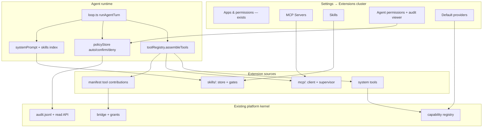
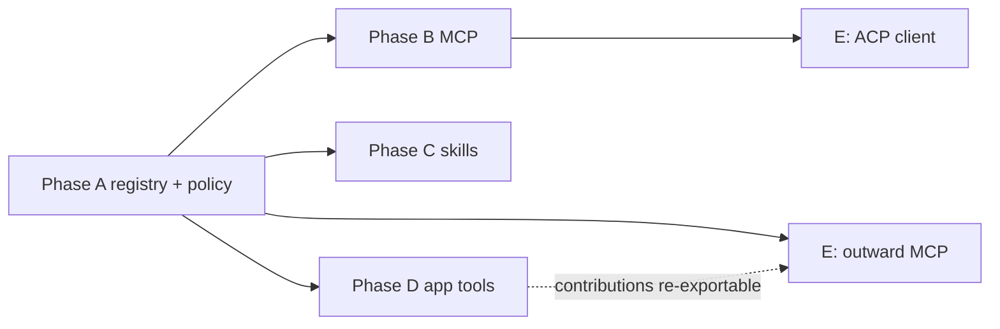

# Agent Extensibility — Complete System Design

MCP servers, skills, dynamic tools, agent permissions, and protocol edges
(ACP, outward MCP) for Arco.

Companion to `docs/app-platform-plan.md`: that doc covers how *apps* extend
the OS; this one covers how the *agent's* capabilities extend. They meet in
the middle — same grant vocabulary, same audit log, same Settings surface,
same brand-free-boundary rule (app-platform principle 7).

> Lineage: `Project-planning.md` already specifies an "Extensions workspace —
> MCP servers & skills marketplace" (Phase P1) and the mcp-bridge integration
> matrix (Calendar → Google Calendar MCP, Email → Gmail MCP, Tickets →
> Linear/GitHub MCP…). `DESIGN-SYSTEM-SPEC.md` gives the trust framing (MCP
> Apps as Tier-3 iframes badged external; §11 token-budget skills pattern).
> The Longformer demo UI already mocked the Extensions hub (Agent Skills |
> Plugins | Prompts | App Templates).

---

## 1. Current state (audit, Jul 2026)

| Fundamental | Status in Arco |
| --- | --- |
| Agent tools | Static `agentTools[]` in `server/agent/tools.ts` (~25 tools); identical list every turn; `findTool` searches only that array |
| MCP client | None — `server/generated/app-prompt.md` explicitly tells the model MCP doesn't exist |
| Skills | None (closest analogues: automation `prompt` field; cached system prompt) |
| App tool contributions | Planned (app-platform Phase 3); `tools?`/`events?` not in manifest schema |
| Agent permissions | Hardcoded: write intents confirm when `interactive`, deny when headless; no per-tool policy store |
| Headless processes | `server/runManager.ts` spawns dev servers only (detached, log file, in-memory map); no supervised lifecycle |
| Audit | `data/audit.jsonl` written by bridge + agent intents; **no read API or UI** |
| ACP | None |
| Capability default-provider picker | Server-side `setProvider()` exists in `server/capabilities/registry.ts`; no UI |

Key seams we build on (from the codebase audit):

- `AgentTool extends LlmToolDef { execute }` already matches the
  function-calling shape `streamTurn({ tools })` consumes — the loop just
  needs a resolver instead of a static import.
- `confirm_required` SSE + `POST /api/confirmations/:id` is a working
  human-approval channel (used by risky `exec` today).
- `grantStore` + `appendAudit` + `AppsSection.tsx` are the template for any
  new "entity with per-key permissions" (store, API, Settings card).
- `runManager.ts` is the precedent for spawning/logging child processes.
- `bus.ts` (EventEmitter) exists but only carries `automations_changed`.

---

## 2. What the references teach us

Concrete architecture notes from the reference repos in
`UI Experiments/reference/`, with the pieces we're adopting.

### 2.1 Joplin — MCP tool registry + per-tool toggles

`joplin/readme/dev/spec/ai_mcp.md` is the cleanest small-scale MCP design
we have (Joplin as MCP *server*, but the registry discipline transfers):

```ts
// Joplin's McpTool — handlers return raw payloads; the dispatcher
// JSON-serialises into MCP text content. No {content, isError} boilerplate.
interface McpTool {
  id: string;
  description: string;
  inputSchema: JsonSchema;
  handler: (input) => Promise<unknown>;
}
```

Adopt:

- **Per-tool toggles with safe defaults** — Joplin ships write tools
  (`create_note`, `update_note`, `delete_note`) **default off**: "Write
  tools default off so users grant write access deliberately." Our per-tool
  policy defaults mirror this (reads `auto`, writes `confirm`).
- **Disabled tools are hidden entirely** from `tools/list`, not just
  rejected — the model never sees what it can't use (saves context, avoids
  temptation).
- **Two error channels**: `ToolError` → LLM-visible, recoverable
  (`isError: true`); any other throw → connection-level error, logged, not
  shown to the model. We replicate this split in the MCP tool adapter.
- **Purpose-built tools, not generic API wrappers**: "An LLM doesn't need
  \[pagination, fields params] — it needs a small, opinionated capability
  surface." Applies directly to Phase E's outward MCP server: expose
  intents, not the REST API.
- **Master toggle** (`mcp.enabled`, 403 when off) + dedicated settings
  section.

### 2.2 agent-canvas — MCP management UI + ACP client

`agent-canvas/src/routes/mcp.tsx` is the production-grade management page:
installed-servers section + marketplace catalog + custom server editor +
delete confirmation, one search box filtering both. Two details worth
copying verbatim:

- Search pairs each installed server with its catalog entry "so the search
  can match friendly names like 'Slack' against a stdio server whose own
  `.name` is just 'slack'."
- The page comment records a key architecture fact: *"MCP servers configured
  via `agent_settings.mcp_config` are now forwarded to the ACP subprocess at
  session creation, so this page is meaningful for both OpenHands and ACP
  agents. The same editor and `mcp_config` storage drive both kinds."* —
  **one MCP config store serves both the native loop and external ACP
  agents.** This is why our `McpServerConfig` shape must match ACP's
  `McpServer` schema from day one.

`agent-canvas/docs/ACP_AGENTS.md` documents the ACP client pattern:

- The server **spawns the agent's own CLI as a subprocess** and relays turns
  over JSON-RPC/stdio; "The external agent manages its own LLM, tools, and
  execution; \[the UI] sends messages and renders what comes back."
- Provider presets + default commands:
  Claude Code → `npx -y @agentclientprotocol/claude-agent-acp`,
  Codex → `npx -y @zed-industries/codex-acp`,
  Gemini → `npx -y @google/gemini-cli --acp`. Custom = any stdio command.
- Credentials are **global secrets named exactly as the env var** the
  subprocess needs (`ANTHROPIC_API_KEY`…) — "Keeping the secret name equal
  to the env var is what makes a saved key actually reach the provider CLI."
  Subscription logins on the host are auto-detected and take priority.
- Agent choice is a settings field (`agent_kind` + `acp_command` +
  `acp_model`); running conversations keep the agent they started with.

`agent-canvas/src/utils/skill-scope.ts` models **skill scopes**: `project`
(`.agents/skills/` in the repo), `personal` (`~/.openhands/skills/`),
`public` (bundled/marketplace) — resolved from the skill's source path.
Their skills settings page: card grid, search, type filter, enable toggles
persisted as a `disabled_skills` list, detail modal, add-skill modal.

`agent-canvas/docs/DefenseClaw.md`: they scan MCP servers with
`cisco-ai-mcp-scanner` and recommend scanning marketplace skills before
loading — supply-chain caution we encode as default-confirm policy now,
scanning later.

### 2.3 openclaw-os — skill gating (`before_tool_call`)

`openclaw-os/packages/claw-plugin/src/index.ts` implements the pattern that
keeps a ~900-line authoring spec out of the always-on prompt — the tool
literally rejects until the skill is read, and the read is detected by
watching the `read` tool's params:

```ts
// openclaw-os claw-plugin (abridged): gate app_create/app_update on a skill read
api.on("before_tool_call", (event, ctx) => {
  // Mark the session once the agent reads the app skill (via the `read` tool).
  if (event.toolName === "read") {
    const filePath = event.params["file_path"] ?? event.params["path"];
    if (typeof filePath === "string" && filePath.includes("openui-app/SKILL.md")) {
      markAppSkillRead(ctx.sessionKey);
    }
    return;
  }
  if (
    (event.toolName === "app_create" || event.toolName === "app_update") &&
    !getAppSkillGate().sessions.has(ctx.sessionKey)
  ) {
    return { block: true, blockReason: APP_SKILL_GATE_MESSAGE };
  }
});
```

Read-sessions persist to a JSON file (`app-skill-read-sessions.json`), so
the gate survives restarts. The block reason is instructional ("Read
`skills/openui-app/SKILL.md` first … Then retry this call.") — the model
self-corrects in one iteration. We generalize this: any skill may declare
`gates: [toolName…]`, and our registry wraps those tools.

### 2.4 matrix-os — demand-paged skills

Whitepaper: skills are markdown files in `~/agents/skills/` with trigger
descriptions; the kernel loads a **table of contents into the system
prompt** and the full body **on demand** — "demand-paged knowledge."
`DESIGN-SYSTEM-SPEC.md` §11 endorses the three-layer version: small
always-injected section → knowledge file on demand → full skill via
`load_skill`. This is exactly our skills index + `read_skill` design.

### 2.5 Hermes — first-party skills, approval UX, toolset chips

- Hermes deliberately contrasts marketplace skills (ClawHub, 10k+
  human-authored, with documented malicious-skill incidents — Koi Security
  / Snyk "ToxicSkills") with **agent-authored skills saved from
  experience**, hot-reloaded from `~/.claude/skills`. We support both:
  seeded/user skills and a `save_skill` tool.
- Approval cards streamed over SSE with **allow-once / allow-session /
  allow-always / deny** — richer than our current yes/no confirmation; the
  "always" answer writes a policy entry so users aren't re-asked. VS Code
  does the same with remembered decisions keyed by a hash of
  tool+params, scoped session | workspace | profile.
- Composer footer **toolset chips** — per-conversation tool scoping. Our
  future mitigation for MCP context bloat; noted, not built now.

### 2.6 puter — scoped tokens at launch

Apps get a scoped token at launch, never the super-token; runtime
`requestPermission()` for escalation. Our bridge already does this for app
windows; the same idea shapes Phase E's outward MCP auth (per-connection
token bound to a grant set, not a session cookie).

---

## 3. Design principles

1. **One tool bus.** MCP tools, app-contributed tools, and system tools all
   become `AgentTool`s in one per-turn assembly, namespaced by source. The
   loop stops importing a static array; nothing else about it changes.
2. **One permission model, three caller kinds.** Apps have grants
   (`grantStore`); the agent gets a parallel policy table
   `(source, tool) → auto | confirm | deny`. Same audit log, same Settings
   surface, same plain-language rendering. Reads default `auto`, writes
   default `confirm`; headless runs treat `confirm` as `deny` (existing
   `interactive` semantics are already correct — keep them).
3. **Config shapes follow the open standards.** MCP server records match
   what ACP's `session/new` forwards; skills are SKILL.md files with
   frontmatter. Portability in both directions comes free.
4. **Progressive disclosure over prompt stuffing** (matrix-os / spec §11):
   index lines in the system prompt, full bodies behind a tool call,
   hard gates where correctness demands it (openclaw-os).
5. **Disabled = invisible** (Joplin): a disabled server/tool/skill is
   absent from the model's world, not present-but-rejected.
6. **Brand-free at every new boundary**: tool namespaces, SKILL.md
   frontmatter, MCP config keys carry no product name.
7. **Precompile what's stable** (inference economy): manifest tool
   contributions compile at install time; MCP schemas cache per connection;
   the skills index rebuilds on change, not per turn.

---

## 4. System overview



New data files (all under `ARCO_DATA_DIR`, JSON like their siblings):

| File | Owner | Contents |
| --- | --- | --- |
| `mcp-servers.json` | `server/mcp/serverStore.ts` | `McpServerConfig[]` |
| `agent-policy.json` | `server/agent/policyStore.ts` | policy map + remembered "always" decisions |
| `skills/<id>/SKILL.md` | `server/skills/skillStore.ts` | one folder per skill |
| `skills/skills.json` | `server/skills/skillStore.ts` | enable flags + read-session gate state |

New API routes (all capability-gated like their siblings):

| Route | Purpose |
| --- | --- |
| `GET/POST/PATCH/DELETE /api/mcp-servers[/:id]` | CRUD + enable/disable |
| `GET /api/mcp-servers/:id/status` | running/stopped/error + tool list |
| `POST /api/mcp-servers/:id/restart` | supervisor restart |
| `GET/PUT /api/agent-policy` | policy table read/write |
| `GET /api/audit?limit=&caller=` | audit read (exists as file only) |
| `GET/POST/PATCH/DELETE /api/skills[/:id]` | skills CRUD + enable |
| `GET/PUT /api/capability-providers` | default-provider picker |

---

## 5. Phase A — Foundation: dynamic tool registry + agent policy

Everything else depends on this. Small by line count; big by consequence.

### 5.1 `server/agent/toolRegistry.ts`

```ts
export type ToolSource =
  | { kind: "system" }
  | { kind: "mcp"; serverId: string }
  | { kind: "app"; appId: string };

export interface RegisteredTool extends AgentTool {
  source: ToolSource;
  /** Access class for policy defaults; MCP tools without annotations => "write". */
  access: "read" | "write";
}

/**
 * Assemble the tool list for one turn. Called once per turn (NOT per
 * iteration — a tool list that mutates mid-turn confuses models), so a
 * server that dies mid-turn fails at call time, which the adapter turns
 * into an LLM-visible error.
 */
export async function assembleTools(ctx: ToolContext): Promise<RegisteredTool[]> {
  return [
    ...systemTools(),                    // today's agentTools, tagged system
    ...(await mcpTools()),               // Phase B: enabled servers' tools
    ...appContributedTools(),            // Phase D: compiled at install time
  ];
}
```

`loop.ts` changes from `import { toolDefs, findTool }` to
`const tools = await assembleTools(ctx)` at turn start; `findTool` becomes a
lookup into that array. `invokeRuntimeTool` (the app-runtime exec/read/db
subset) is untouched.

**Namespacing.** OpenAI function names allow only `[a-zA-Z0-9_-]{1,64}`, so
no dots: `mcp__linear__create_issue`, `app__core-calendar__list_events`
(manifest ids kebab-cased). System tools stay bare. The double-underscore
convention matches what Claude-family hosts already emit, so models have
priors for it.

### 5.2 `server/agent/policyStore.ts`

```ts
export type PolicyDecision = "auto" | "confirm" | "deny";

interface AgentPolicy {
  /** e.g. "mcp:linear", "mcp:linear#create_issue", "app:core.calendar", "system#exec" */
  rules: Record<string, PolicyDecision>;
}

/** Most-specific rule wins: source#tool > source > built-in default. */
export function decide(tool: RegisteredTool): PolicyDecision {
  const key = sourceKey(tool.source);              // "mcp:linear"
  const rules = load().rules;
  return (
    rules[`${key}#${tool.name}`] ??
    rules[key] ??
    (tool.access === "read" ? "auto" : "confirm")  // Joplin default posture
  );
}
```

Loop integration, reusing the existing confirmation machinery:

```ts
// loop.ts, before tool.execute(...)
const decision = ctx.interactive ? decide(tool) : hardenHeadless(decide(tool));
appendAudit({ caller: { kind: "agent", sessionId: ctx.sessionId },
              method: `tool:${tool.name}`, allowed: decision !== "deny" });
if (decision === "deny") return { error: `Denied by agent policy: ${tool.name}` };
if (decision === "confirm") {
  const ok = await requestConfirmation(ctx, describeToolCall(tool, args));
  if (!ok) return { error: "User declined" };
}
```

`hardenHeadless` maps `confirm → deny` — the exact semantics automations
already have, now expressed in one place instead of scattered per-tool.

**Approval upgrades (Hermes/VS Code pattern):** extend the
`confirm_required` payload with `options: ["once", "session", "always",
"deny"]`. "Always" writes a `source#tool → auto` rule; "session" remembers
in the in-memory turn context. The chat `ConfirmCard` gains the two extra
buttons. (Ship the four-option card in Phase A; it's a small diff on an
existing flow.)

### 5.3 Audit read API + agent identity

- `GET /api/audit?limit=200&caller=agent|app` — tail of `audit.jsonl`,
  parsed, newest first. Capability `settings:write` to read (it reveals
  activity across users; revisit with multi-user).
- Audit entries for tool calls carry the resolved policy decision so the
  viewer can answer "why did/didn't this run".

### 5.4 Default-providers picker (cheap win, rides along)

`server/capabilities/registry.ts` already has `getProviders`/`setProvider`
and throws for non-system providers. Add `GET/PUT /api/capability-providers`
+ a small Settings section listing each contract with a provider dropdown
(only "System" today; the UI existing is what makes swappability visible).

**Exit criteria.** A runtime-injected fixture tool appears to the model,
executes through policy, lands in the audit log with its decision; a
`deny` rule visibly blocks it; "always allow" from the confirm card stops
future prompts for that tool.

---

## 6. Phase B — MCP servers

Arco as MCP host: users add servers; their tools join the agent.

### 6.1 Config store — `server/mcp/serverStore.ts`

The shape mirrors ACP's `McpServer` union (stdio | http | sse) so the same
records can be forwarded to an ACP subprocess later (the agent-canvas
lesson: one store drives both native and ACP agents):

```ts
export interface McpServerConfig {
  id: string;                       // slug, unique: "linear"
  name: string;                     // display: "Linear"
  transport:
    | { kind: "stdio"; command: string; args?: string[]; env?: Record<string, string> }
    | { kind: "http"; url: string; headers?: Record<string, string> }   // streamable HTTP
    | { kind: "sse"; url: string; headers?: Record<string, string> };   // legacy servers
  enabled: boolean;
  /** Joplin pattern: per-tool opt-out; disabled tools hidden from the model. */
  disabledTools?: string[];
  addedAt: string;
}
```

Env values and header values may contain secrets: persist them like the LLM
API key (`settings.json` precedent) — stored plain in the data dir, masked
(`••••`) on API reads, mask-echo ignored on write. A real secrets vault
(the Passport workspace from Project-planning) is out of scope.

### 6.2 Protocol client — `server/mcp/client.ts`

Thin wrapper over the official SDK; no hand-rolled JSON-RPC:

```ts
import { Client } from "@modelcontextprotocol/sdk/client/index.js";
import { StdioClientTransport } from "@modelcontextprotocol/sdk/client/stdio.js";
import { StreamableHTTPClientTransport } from "@modelcontextprotocol/sdk/client/streamableHttp.js";

export interface McpConnection {
  client: Client;
  tools: McpToolInfo[];             // cached tools/list result
  status: "running" | "error";
  error?: string;
}

export async function connect(cfg: McpServerConfig): Promise<McpConnection> {
  const transport =
    cfg.transport.kind === "stdio"
      ? new StdioClientTransport({
          command: cfg.transport.command,
          args: cfg.transport.args ?? [],
          env: { ...process.env, ...cfg.transport.env },
        })
      : new StreamableHTTPClientTransport(new URL(cfg.transport.url), {
          requestInit: { headers: cfg.transport.headers },
        });
  const client = new Client({ name: "arco", version: "0.1.0" });
  await client.connect(transport);
  const { tools } = await client.listTools();
  return { client, tools, status: "running" };
}
```

Tool schemas are cached on the connection; refresh on the
`notifications/tools/list_changed` notification (subscribe if the server
declares the capability) or on reconnect. v1 surface is **tools only** —
resources/prompts/sampling deliberately later (Joplin's v1 made the same
cut and it held).

### 6.3 Supervisor — `server/mcp/supervisor.ts`

Owns lifecycle; the `runManager` pattern grown up:

- Boot: connect every `enabled` server (parallel, isolated failures).
- Enable/disable/edit from the API: connect / disconnect / reconnect.
- stdio stderr → `data/run-logs/mcp-<id>.log` (view-log link in Settings).
- Crash → status `error` with message; **retry with exponential backoff,
  max 3**, then stay `error` until manual restart. A dead server never
  takes the agent loop down — its tools simply drop out of the next
  assembly.
- `status()` powers `GET /api/mcp-servers/:id/status` and the Settings
  status dots; emits `mcp_changed` on the bus so an open Settings panel
  live-updates (same pattern as `automations_changed`).

### 6.4 Tool adapter — registry integration

```ts
// server/mcp/tools.ts
export async function mcpTools(): Promise<RegisteredTool[]> {
  return supervisor.connections().flatMap(({ cfg, conn }) =>
    conn.tools
      .filter((t) => !cfg.disabledTools?.includes(t.name))
      .map((t) => ({
        name: `mcp__${cfg.id}__${t.name}`,
        description: `[${cfg.name}] ${t.description ?? t.name}`,
        parameters: t.inputSchema,
        source: { kind: "mcp", serverId: cfg.id },
        // MCP annotations are hints; absent => treat as write (default confirm).
        access: t.annotations?.readOnlyHint ? "read" : "write",
        execute: async (args) => {
          const result = await conn.client.callTool({ name: t.name, arguments: args });
          // Joplin's two-channel split: isError => LLM-visible failure it can
          // recover from; transport throw => generic error, details to the log.
          if (result.isError) return { error: flattenContent(result.content) };
          return flattenContent(result.content); // text/JSON for the LLM
        },
      })),
  );
}
```

`flattenContent` concatenates text parts and JSON-stringifies structured
content; image/audio parts become `[image omitted]` placeholders until the
chat surface can render them. Results ride the existing
`MAX_TOOL_RESULT_CHARS` truncation.

### 6.5 Settings → MCP Servers (`McpServersSection.tsx`)

Follows `AppsSection.tsx` structure; agent-canvas layout, sized to our
Settings idiom:

- Per-server card: status dot (green running / grey disabled / red error
  with message), name + transport summary, enable toggle, restart, delete
  (with confirm), view log.
- Expandable tool list per server: each tool shows name + description, an
  enable toggle (`disabledTools`), and a policy chip cycling
  auto → confirm → deny (writes `mcp:<id>#<tool>` rules).
- Add server form: name, transport kind, command/args/env rows **or**
  URL/headers rows. Validate by attempting a connection before saving
  ("Test connection" = connect + list tools + show count).
- No marketplace in v1. Later: a curated `catalog.json` (agent-canvas
  ships its catalog as a static module) rendered as install tiles that
  pre-fill the form.

**Exit criteria.** Add a real server (filesystem or GitHub MCP) in
Settings; agent lists/calls its tools with confirmation; per-tool disable
hides it from the model; killing the server process shows the error state,
and the next agent turn works with the remaining tools.

---

## 7. Phase C — Skills

Reusable instruction bundles, progressively disclosed, optionally gating.

### 7.1 Format — SKILL.md with frontmatter

Portable with the broader SKILL.md ecosystem (Claude/Cursor skills,
ClawHub, agent-canvas):

```markdown
---
name: Meeting notes format
description: How to structure meeting notes when the user asks for a summary
   of a call or meeting. Use whenever output is meeting minutes.
gates: []            # optional: tool names blocked until this skill is read
enabled: true
source: user         # seed | user | app:<appId>
---

When writing meeting notes:
1. Lead with decisions, then action items (owner + due date), then discussion.
...
```

Storage: `data/skills/<id>/SKILL.md` (one folder per skill so bundled
assets can join later), plus `data/skills/skills.json` for fast listing +
gate state. Seeds ship in repo-root `./skills/` and copy on boot exactly
like `./apps/` seeds core apps.

### 7.2 Store + API — `server/skills/skillStore.ts`

`list() / get(id) / create / update / setEnabled / remove`, frontmatter
parsed with `gray-matter` (or a 20-line hand parser — frontmatter here is
three known keys). Scope model (agent-canvas): `seed | user | app:<id>` —
we skip their "project" scope until Arco has per-project agent context.

### 7.3 Prompt integration — the index

`buildSystemPrompt()` gains a skills block, rebuilt when skills change
(bus event `skills_changed` invalidates the cached preamble — the cache key
becomes `{identityRev, skillsRev}` so prompt caching keeps working):

```
## Skills
You have skills — instruction files you must read before relying on them.
Read one with read_skill(id). Available:
- meeting-notes: How to structure meeting notes when the user asks…
- openui-app-authoring: REQUIRED before app_create/app_update. Full OpenUI
  app surface reference. (gates: app_create, app_update)
```

Index lines only — full bodies are never auto-injected (matrix-os
"demand-paged knowledge"; spec §11).

### 7.4 Tools + gating

- `read_skill(id)` — returns the body; records
  `(sessionId, skillId)` in gate state (persisted, like openclaw-os's
  `app-skill-read-sessions.json`, so restarts don't reopen gates).
- `save_skill(name, description, body)` — the Hermes "first-party skills
  from experience" pattern: the agent distills a lesson into a durable
  skill. Policy class: write ⇒ default `confirm`, so the user approves
  additions to their agent's standing instructions.
- **Gating** — generalized from openclaw-os, implemented in the registry
  wrap (we have no plugin hook system, and don't need one):

```ts
// toolRegistry.ts — wrap gated tools instead of a before_tool_call hook
function applySkillGates(tools: RegisteredTool[], ctx: ToolContext) {
  const unread = skillStore.gatingSkillsUnread(ctx.sessionId);
  return tools.map((tool) => {
    const gate = unread.find((s) => s.gates.includes(tool.name));
    if (!gate) return tool;
    return {
      ...tool,
      execute: async () => ({
        error: `Read skill "${gate.id}" first (read_skill) — it documents ` +
               `how to use ${tool.name} correctly. Then retry this call.`,
      }),
    };
  });
}
```

The instructional error is the point — the model self-corrects in one
iteration (observed working in openclaw-os).

- **Migration payoff:** the ~900-line OpenUI app-authoring prompt moves
  from the always-on system prompt into a seeded, gating skill on
  `app_create`/`app_update`. Every non-app-building turn gets that context
  back.

### 7.5 Settings → Skills (`SkillsSection.tsx`)

Card list: name, description, source badge (seed/user/app), enable toggle
(disabled skills leave the index entirely), gate badges, view/edit body in
a textarea (prototype-grade), create form, delete for `user` skills.

**Exit criteria.** A "meeting notes format" skill changes agent output only
after the agent reads it; disabling removes it from the index; the agent
saves a new skill from a chat instruction (with confirmation); the OpenUI
skill gate blocks `app_create` until read.

---

## 8. Phase D — App tool contributions + events

Closes app-platform-plan Phase 3: installed apps extend the agent.

### 8.1 Manifest extension

```ts
// shared/manifest.ts additions
export interface ToolContribution {
  name: string;                       // "create_task" (namespaced by the compiler)
  description: string;
  parameters: JsonSchema;             // JSON Schema, same as LlmToolDef
  /** Deterministic binding — no app code runs to dispatch the tool. */
  binding:
    | { kind: "intent"; intent: string }          // routes via capability registry
    | { kind: "storage-query"; sql: string };     // parameterized read on the app's own namespace
}

export interface AppManifest {
  // ...existing fields...
  tools?: ToolContribution[];
  events?: { emits: string[]; subscribes: string[] };
}
```

Bindings are deliberately declarative in v1: a contributed tool maps to an
intent (already permissioned, audited, provider-swappable) or a
parameterized read of the app's own storage namespace. Arbitrary
app-executed tools (postMessage round-trip into a live window, or a
headless process) wait until a real app needs them — dispatch stays
deterministic code, per spec D10.

### 8.2 Compilation + dispatch

- On install/enable, contributions compile to `RegisteredTool`s
  (`app__<kebab-id>__<name>`, `source: {kind:"app", appId}`) and persist in
  memory keyed by app — **install-time, not per-turn** (inference economy).
- Execution dispatches through the existing bridge path with the **app's**
  identity: the app's own grants must cover the bound intent, so an app
  cannot smuggle the agent past its grant sheet; the agent's policy is
  checked on top (`app:<id>` rules, write intents default confirm).
- The Settings grant sheet gains a "Contributes agent tools: …" block so
  installs disclose what they add to the user's agent.

### 8.3 Events

`server/bus.ts` grows manifest-gated topics: apps declare `emits` /
`subscribes`; the bridge gains `events.emit` / `events.subscribe` (SSE per
app window, the AppHost relays); the agent can subscribe via a system tool
later. Calendar emits `calendar.changed` as the pilot topic so a future
widget/automation can react to agent-created events.

---

## 9. Phase E — Protocol edges (ACP + outward MCP)

Deliberately last; every store above is shaped for it.

### 9.1 ACP disambiguation (recorded once, since the acronym collides)

**ACP here = Zed's Agent Client Protocol** (agentclientprotocol.com):
editor/shell ↔ coding agent over JSON-RPC/stdio — the protocol agent-canvas
uses to drive Claude Code, Codex, and Gemini CLI. Not IBM's Agent
Communication Protocol, not the Agent Commerce Protocol. Composition with
MCP: ACP is how a shell drives an agent; MCP is how that agent reaches
tools; ACP's `session/new` **forwards MCP server configs** so the agent
connects to the user's servers directly. Roles flip between the protocols:
in MCP the AI app is the client; in ACP the shell is the client and the
agent is the subprocess.

### 9.2 Arco as ACP client — pluggable Studio agents

> **Status: built.** `server/acp/acpAgent.ts` + Settings → Agent chips.
> One warm subprocess per chat session; enabled MCP servers forward into
> `session/new`; permission requests ride the existing confirm card; fs
> read/write is confined to the active project root and emits
> `file_changed` diffs. `scripts/acp-test-agent.mts` is a scripted ACP
> agent used to smoke-test the full protocol round trip.

- Settings → Model provider grows an **Agent** choice: `built-in` (today's
  loop) or `acp` with a command preset (Claude Code / Codex / Gemini /
  custom — agent-canvas's preset table transfers directly, including
  `npx -y` default commands).
- `server/acp/` spawns the subprocess per session, does the
  `initialize` / `session/new` handshake — passing
  `mcpServers: serverStore.list().filter(enabled)` (this is why Phase B's
  shape matters) — and translates the streams:

| ACP (agent → shell) | Arco `AgentEvent` |
| --- | --- |
| `session/update` text chunks | `text_delta` |
| tool-call updates | `tool_start` / `tool_end` |
| permission request (bidirectional JSON-RPC) | `confirm_required` → answer from the existing confirmation card |
| file edits | `file_changed` |

- Credentials follow agent-canvas's rule: env vars named exactly what the
  CLI reads, from the settings store; host subscription logins win
  automatically when present, so local use often needs no key.
- The built-in loop remains the default and the only agent for
  automations in v1 (headless ACP has its own lifecycle questions).

### 9.3 Arco as MCP server — outward

The §10.8 rung-5 story ("build an app in Arco, use it in Claude"):

- `POST /mcp` endpoint (Joplin: reuse the existing authenticated HTTP
  service, no second port) implementing `initialize`, `tools/list`,
  `tools/call` over the official SDK's server classes.
- Exposed tools are **capability intents, not REST wrappers** (Joplin's
  "purpose-built, not a Data API wrapper"): `calendar_list_events`,
  `calendar_create_event`, … — the same intent dispatch, provider-agnostic.
- Identity: a dedicated token type (puter-style scoped token, not a user
  session cookie) minted in Settings with a chosen grant set; calls audit
  as `caller: { kind: "external", tokenId }`. Master toggle default off,
  write intents default off (Joplin posture).

### 9.4 Explicitly not doing

A2A/agent-to-agent negotiation (future-ideas §4 marks it P3+), marketplace
hosting, WASM skill execution, MCP resources/prompts/sampling in v1,
sandboxed scanning of MCP servers (DefenseClaw pattern — noted for later).

---

## 10. Settings information architecture

The flat Settings list is at capacity. When Phase B lands, group into an
**Extensions** cluster (agent-canvas nav: Skills | MCP Servers | Plugins;
Longformer mock: Agent Skills | Plugins | Prompts | App Templates):

- **Apps & permissions** (exists)
- **MCP Servers** (Phase B)
- **Skills** (Phase C)
- **Agent permissions** (Phase A: policy table + audit viewer)
- **Default providers** (Phase A rider)

Implementation note: keep them as sections in `SettingsApp.tsx` first; a
sub-nav is worth it only when the sections exist. Don't build the shell
before the content.

## 11. Build order and dependencies



Recommended: **A + B together** (the registry alone has nothing to show;
MCP is the visible payoff), then **C** (skills + the OpenUI prompt
migration), then **D**, then **E** as demand appears. Each phase lands with
its Settings section — no invisible infrastructure.

## 12. Risks / open questions

- **Context budget.** Every enabled server's tool schemas ride every turn.
  Mitigations in order: per-tool disable (B), server enable (B), composer
  toolset chips (Hermes pattern, later). Measure: log assembled tool count
  + estimated tokens per turn in dev.
- **Untrusted servers.** stdio MCP servers run with server-process
  authority. v1 answer: default-confirm policy + audit + logs. Later:
  scanner integration (DefenseClaw), container isolation (nanoclaw
  pattern).
- **Prompt-cache invalidation.** Skills index and MCP tool lists mutate the
  system prompt/tool array; cache keys must include their revisions or
  provider-side prompt caching quietly stops hitting.
- **Name collisions.** Namespacing solves the model-facing name; Settings
  must still disambiguate two servers named "search" (friendly-name search
  pairing, agent-canvas).
- **Schema fidelity.** Some MCP servers emit JSON Schema features OpenAI
  function-calling rejects (unions, refs). The adapter needs a
  schema-sanitizer pass; log and skip tools whose schemas can't be
  sanitized rather than failing the server.
- **Headless + MCP.** Automations get MCP tools with `confirm → deny`
  hardening; a cron job that needs a write tool must have an explicit
  `auto` rule. Document this in the automation UI when it bites.
- **Windows portability** of stdio spawning — same constraints as
  `runManager`; acceptable for the prototype.
