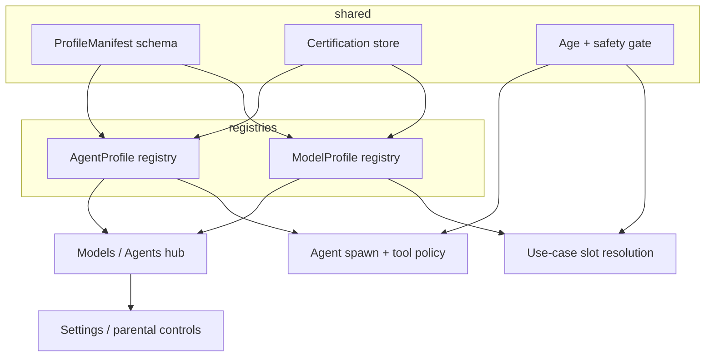

# Model & Agent Profiles — System Design

> Written 2026-07-07. Companion to `model-hub-plan.md` (model registry),
> `memory-plan.md` (agent principals), `agent-extensibility-plan.md` (tool
> policy + skills), and `app-platform-plan.md` (manifests + grants).
>
> **Status: PROPOSED.** Nothing here is shipped yet. Models have a typed
> registry (`shared/models.ts`) but no structured safety, age, or
> certification fields. Agents are configured across settings, tool policy,
> skills, MCP, and ACP presets — there is no agent registry or unified
> listing surface.

## Why

Arco lists models in the Models app and configures agents across Settings,
Studio, and external runtimes — but there is no shared vocabulary for
**what a model or agent is allowed to do**, **who it is suitable for**, or
**what evidence we have that it behaves acceptably**.

Today:

- Model benchmark notes live in free-text `description` strings and loose
  `meta` keys (`speedTier`, `experimental`).
- Agent identity is fragmented: `AgentKind`, ACP presets, channel bots, and
  automations each configure behavior separately.
- Three different things are all called "capabilities": model modality
  (`text.chat`), user auth permissions (`chat`, `exec`), and agent tools.
- Age restrictions and content safety levels are not defined for models or
  agents anywhere in the stack.
- The legacy TestBench (`model-manager/`) measures local latency but results
  are not stored as structured certification data.

We need a **profile** concept: a typed manifest for anything listable in the
Models/Agents hub, with capacities, safety levels, age restrictions, and
test-passing evidence — enforced consistently at slot resolution, agent
spawn, and UI selection.

## Design principles

1. **Two registries, one profile schema.** Models and agents remain distinct
   entities with different runtime fields, but share a common
   `ProfileManifest` base for listing, labeling, safety, audience, and
   certification.
2. **Separate model risk from agent risk.** A frontier LLM may be
   content-safe in isolation; an agent running it with `exec` and MCP is a
   different operational risk. Model safety and agent safety are both typed,
   evaluated separately, and combined at enforcement time.
3. **Capabilities ≠ capacities ≠ auth.** Model modality joins use-case slots.
   Agent affordances describe tools/memory/MCP access. User auth capabilities
   gate API routes — they do not describe model or agent suitability.
4. **Evidence over marketing copy.** Certification is structured
   `TestSuiteResult[]` records, not prose in `description`. UI labels derive
   from suite status, not hand-written badges.
5. **Default to cautious.** User-added profiles start as `unevaluated` with
   conservative tool policy until certification suites pass.
6. **Reuse existing patterns.** Extend the model registry
   (manifest → disk JSON → API → UI), agent policy store, memory principal
   IDs, and app-platform grant vocabulary — do not invent a third catalog
   system.

---

## 1. Current state (audit)

| Layer | What exists | Gap |
| --- | --- | --- |
| **Models** | `ModelManifest`, `RegisteredModel`, use-case slots, Models app | No typed safety, age, or certification; `meta` is unstructured |
| **Agents** | `AgentKind`, tool policy, skills, MCP, ACP presets | No agent registry; no unified profile or listing UI |
| **User auth** | `Capability`, `Role`, `ROLE_CAPABILITIES` | Orthogonal — gates routes, not content/operational suitability |
| **Benchmarks** | Prose in seeds; TestBench in Tauri model-manager | No structured results; not ported to Models app |
| **Parental controls** | Stub in `settingsStubMock.ts` | Not wired to model/agent selection |

Key files today:

| File | Role |
| --- | --- |
| `shared/models.ts` | Model registry types + seeds + use-case slots |
| `server/stores/modelStore.ts` | Persistence + slot resolution |
| `src/apps/models/ModelsApp.tsx` | Slot picker + model library (capability badges only) |
| `shared/types.ts` | `AgentKind`, `ACP_PRESETS`, user `Capability` |
| `server/agent/policyStore.ts` | Per-tool `auto` / `confirm` / `deny` rules |
| `shared/capabilities/memory.ts` | `MemoryPrincipalId` — planned agent identity strings |
| `docs/memory-plan.md` §3 | Agent principals — design only |

---

## 2. Profile schema

### 2.1 Shared base — `ProfileManifest`

Anything listable in the Models/Agents hub extends this base:

```ts
interface ProfileManifest {
  /** Reverse-DNS-ish id, e.g. "openai.gpt-5.5" or "agent:builtin". */
  id: string;
  name: string;
  description?: string;
  kind: "model" | "agent";

  /** Typed affordances — not a free-form meta bag. */
  capacities: ProfileCapacity[];

  safety: SafetyProfile;
  audience: AudienceProfile;
  certification: CertificationProfile;

  /** Controlled UI chips — derived + editorial. */
  labels: ProfileLabel[];

  source: "seed" | "url" | "user";
}
```

### 2.2 Safety

```ts
interface SafetyProfile {
  /** Content + operational posture at a glance. */
  level: "restricted" | "standard" | "elevated" | "unrestricted";

  /** Default tool policy posture for agents; informational for models. */
  defaultPolicy?: "conservative" | "balanced" | "permissive";

  contentFilters?: ("nsfw" | "violence" | "self-harm" | "pii")[];

  /** Tool ids or intent patterns that always require confirmation. */
  requiresConfirmation?: string[];
}
```

Mapping to existing `AgentPolicyDecision` (`auto` / `confirm` / `deny`):

| Safety level | Tool defaults | Typical use |
| --- | --- | --- |
| `restricted` | Mostly `deny`; reads only | Child profile, channel bots |
| `standard` | `confirm` on writes/exec | Default built-in agent |
| `elevated` | `auto` on most tools; confirm on exec | Power user / dev |
| `unrestricted` | Explicit opt-in only | Admin-only; never default |

Agent profiles carry **default policy**; user overrides remain in
`policyStore`. Parental controls gate which profiles a user may enable.

### 2.3 Audience (age restrictions)

```ts
interface AudienceProfile {
  minAge: 13 | 16 | 18 | null;   // null = general audience
  parentalGate?: boolean;          // requires elevated role to enable
  restrictedContexts?: ("child-profile" | "shared-device" | "automation")[];
}
```

Age is enforced at **profile selection**, not baked into model strings alone.
An agent running a frontier model with `exec` is a different risk than
chat-only — gate the agent profile, not just the model.

### 2.4 Certification (test passing)

```ts
interface CertificationProfile {
  suites: TestSuiteResult[];
  lastEvaluatedAt?: string;
  overallStatus: "pass" | "partial" | "fail" | "unevaluated";
}

interface TestSuiteResult {
  suiteId: string;               // e.g. "arco.agent-smoke-v1"
  label: string;
  status: "pass" | "fail" | "skipped";
  score?: number;                // 0–1 or normalized
  runAt: string;
  details?: Record<string, unknown>;
}
```

UI labels derived from status:

| Label | Condition |
| --- | --- |
| **Certified** | All required suites `pass` |
| **Partial** | Some pass; show which failed |
| **Unevaluated** | No suites run (typical for user-added entries) |
| **Experimental** | Explicit editorial flag — not a substitute for unevaluated |

### 2.5 Model profile

Extends the base with existing registry fields:

```ts
interface ModelProfile extends ProfileManifest {
  kind: "model";
  capabilities: ModelCapability[];  // join key for use-case slots
  runtime: ModelRuntime;
  meta?: {
    costTier?: 1 | 2 | 3 | 4;
    speedTier?: 1 | 2 | 3 | 4;
    contextWindow?: number;
    provider?: string;
  };
}
```

Migrate loose `meta` keys on seeds into typed fields over time.

### 2.6 Agent profile

Extends the base with runtime behavior:

```ts
interface AgentProfile extends ProfileManifest {
  kind: "agent";
  principalId: MemoryPrincipalId;  // see memory-plan.md §3
  runtime: {
    kind: "builtin" | "acp" | "cursor";
    acpPresetId?: string;
    cursorConfig?: Record<string, unknown>;
  };
  modelSlot?: UseCaseSlotId;       // which model slot this agent resolves
  toolPolicyDefaults: AgentPolicyRule[];
  memoryGrantDefaults?: MemoryGrant[];
  skillGates?: string[];
}
```

Seed profiles:

| Id | Principal | Notes |
| --- | --- | --- |
| `agent:builtin` | `agent:builtin` | Default chat + Studio |
| `agent:acp:claude-code` | `agent:acp:<hash>` | From ACP preset |
| `agent:automation:<id>` | `agent:automation:<id>` | Narrow grants |
| `agent:channel:<id>` | `agent:channel:<id>` | DM bots |

---

## 3. Capacities — three layers, one vocabulary

| Layer | Type | Examples | Used for |
| --- | --- | --- | --- |
| **Model modality** | `ModelCapability` | `text.chat`, `speech.stt` | Slot assignment (`agent.chat`, `voice.brain`) |
| **Agent affordances** | `AgentCapacity` | `tools.exec`, `tools.browser`, `memory.write`, `mcp.external` | What an agent profile may request |
| **Profile suitability** | `ProfileCapacity` | `long-context`, `multimodal`, `function-calling`, `local-only` | UI labels + eligibility rules |

Slot resolution stays unchanged: `requires: "text.chat"`. Safety and age
sit **above** slots — a model may be assigned to `agent.chat` but blocked for
a child profile or automation context.

---

## 4. Certification suites

| Suite id | Purpose | Where it runs |
| --- | --- | --- |
| `arco.smoke-v1` | Tool calling, JSON mode, basic safety refusals | CI on seed models |
| `arco.latency-local` | TTFT, tok/s (port TestBench) | On-device after GGUF download |
| `arco.agent-e2e-v1` | Full turn with mock tools | Nightly against assigned slot |
| External ingest | MMLU, HumanEval, provider safety cards | Read-only metadata from providers |

End-to-end suites evaluate the **agent + resolved model pair**, not the
model alone.

Storage: `data/profile-certifications.json`, keyed by profile id. Results
append-only with `runAt` timestamps.

Port `model-manager/src/components/TestBench.tsx` into the Models app as the
latency suite runner.

---

## 5. Enforcement points

```ts
function canUseProfile(
  profile: ProfileManifest,
  context: {
    userAge?: 13 | 16 | 18;
    role: Role;
    surface: "chat" | "automation" | "channel" | "studio";
  }
): { allowed: boolean; reason?: string };
```

| Point | Behavior |
| --- | --- |
| **Slot resolution** | `resolveModel("agent.chat")` filters candidates by active user/profile context |
| **Agent spawn** | ACP/Cursor presets check agent profile before launch |
| **Automations** | Stricter default — profiles with `restrictedContexts: ["automation"]` blocked unless certified |
| **UI** | Gray out disallowed profiles with explanation ("Requires 18+ or admin approval") |

---

## 6. UI — listing and labeling

One hub (extend Models app or sibling Agents tab), two sections:

**Models** — existing slot picker + library, enriched cards:

```
[GPT-5.5]  [frontier] [certified] [18+]
Capabilities: Chat · Tools · Long context
Safety: Standard · Cost: $$$ · Speed: Fast
Suites: smoke ✓ · agent-e2e ✓ · latency —
```

**Agents** — unified listing (today fragmented across Settings):

```
[Built-in Agent]  [certified] [standard safety]
Model slot: Agent & Chat · Tools: 24 · Policy: balanced

[Claude Code (ACP)]  [partial] [elevated] [18+]
External runtime · Confirm on exec
```

Reuse: `Badge`, `ModuleDashboard`, Skills card grid, AgentSection policy
chips.

### Label taxonomy (controlled enum)

| Category | Values |
| --- | --- |
| Trust | `certified`, `partial`, `unevaluated`, `experimental` |
| Audience | `13+`, `16+`, `18+`, `admin-only` |
| Safety | `restricted`, `standard`, `elevated` |
| Origin | `local`, `cloud`, `external-runtime` |
| Cost / speed | `cost-tier-1..4`, `speed-tier-1..4` |

---

## 7. Architecture



**kosmos-steamos** should consume `/api/profiles` (or extend `/api/models`)
once Arco defines it — no duplicate types in the shell.

---

## 8. Open decisions

1. **Who certifies?** OS-run suites only, or also ingest provider safety
   cards (OpenAI, Anthropic, OpenRouter) as third-party attestations?
2. **User-added models** — always `unevaluated` until a local bench runs, or
   allow community-submitted suite results?
3. **Pair certification** — e2e suites run against `(agentProfile,
   resolvedModel)`; document which suites are model-only vs pair-only.
4. **Default posture** — confirm that new user-added profiles start
   `restricted` / `unevaluated` / confirm-heavy until certified.

---

## 9. Phased roadmap

| Phase | Deliverable | Depends on |
| --- | --- | --- |
| **0 — Types only** | `shared/profiles.ts`, Zod schema; migrate seed `meta` → typed fields | Model hub Phase 4a (registry landed) |
| **1 — Model labels** | Render safety/age/cert badges in ModelsApp; ingest OpenRouter metadata | Phase 0 |
| **2 — Agent registry** | Seed `agent:builtin`, ACP presets, automations; Agents tab | Phase 0; memory-plan §3 principals |
| **3 — Certification runner** | Port TestBench + smoke suite; `data/profile-certifications.json` | Phase 1 |
| **4 — Enforcement** | Gate slot resolution + agent spawn by user context | Phase 2; auth roles |
| **5 — Parental controls** | Profile allowlists per user/role | Phase 4; settings parental stub |

Phase 0–1 is low risk: typed vocabulary + visible labels, no enforcement yet.

---

## 10. File map (when implemented)

| Concern | Planned path |
| --- | --- |
| Types | `shared/profiles.ts` |
| Validation | `server/stores/profileSchema.ts` |
| Model profiles | extend `shared/models.ts` or compose via `ModelProfile` |
| Agent profiles | `shared/agents.ts` (new) |
| Certification store | `server/stores/certificationStore.ts`, `data/profile-certifications.json` |
| API | `server/routes/profiles.ts` — list, certify, gate check |
| UI | extend `src/apps/models/ModelsApp.tsx` or `src/apps/agents/` |
| Enforcement | `modelStore.ts` slot resolution; `acpAgent.ts` / spawn paths |

---

## 11. Acceptance criteria (v1)

- [ ] Every seed model has typed `safety`, `audience`, and `certification` fields
- [ ] Models app shows trust, audience, and safety badges (not just capability chips)
- [ ] Built-in and ACP agents appear in a unified Agents listing with profile metadata
- [ ] At least one certification suite (`arco.smoke-v1` or `arco.latency-local`) stores structured results
- [ ] `canUseProfile()` exists and is called from slot resolution (even if all profiles pass initially)
- [ ] Docs cross-linked from `roadmap.md` when work begins
