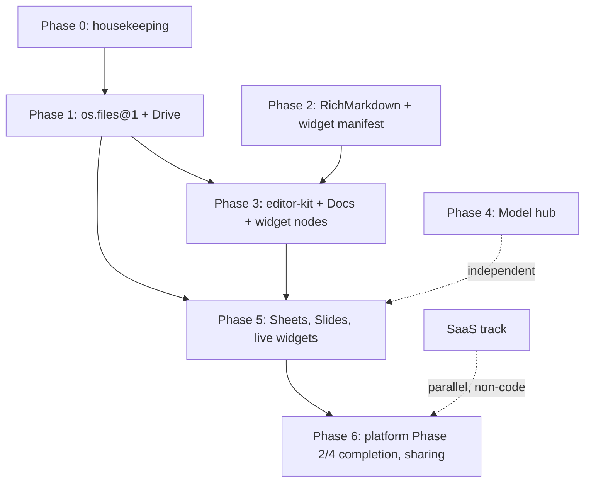

# Arco OS — Consolidated Roadmap

> Written 2026-07-05. Synthesizes the seven planning docs in `docs/` against a
> verified codebase audit (git history + implementation inventory). This is the
> prioritization layer — each phase below links back to the detailed plan doc
> that owns its execution.

---

## 1. Where we are (verified against the code, not the docs)

### Shipped and committed

| Area | Status | Evidence |
| --- | --- | --- |
| **OS shell** — windows, dock, menu bar, notifications, themes, mobile shell | Done | `src/os/` |
| **Agent chat + Studio** — SSE streaming, tool cards, sessions, composer, drawer (Files/Git/Terminal/Browser/Preview) | Done | `src/apps/chat/`, `src/apps/studio/` |
| **Generated OpenUI apps** — versioned, adaptive, live data binding | Done | `server/stores/appStore.ts`, `src/apps/appview/` |
| **Auth** — accounts, roles/capabilities, sessions, lock, boot flow | Done | `server/auth/`, `src/os/auth/` |
| **Automations** — cron scheduler, run history, manager app | Done | `server/automations/` |
| **Agent cursor** — snapshot/click/type virtual mouse | Done (known limits in `agent-cursor.md`) | `src/os/cursor/` |
| **Voice** — Pipecat pipeline, WebRTC, face rig, `/v1/chat/completions` loopback | Done | `voice-server/`, `src/voice/` |
| **App platform Phase 1** — manifest, grants, bridge, AppHost, app-sdk | Done | `server/platform/`, `packages/app-sdk/` |
| **App platform Phase 2 (pilot)** — `os.calendar@1` contract, calendar service, `core.calendar` Tier-3 app | Done (partially — see gaps) | `shared/capabilities/calendar.ts`, `apps/calendar/` |
| **Agent extensibility Phases A–E** — tool registry, policy store, audit API, MCP client (stdio/http/sse + supervisor), skills (+gating), app tool contributions, outward MCP server, ACP client | **All done** | commits `312cdd1`…`96d578e`; `server/agent/toolRegistry.ts`, `server/mcp/`, `server/skills/`, `server/acp/` |

### Built but uncommitted (working tree, 2026-07-05)

- **Channels (Telegram)** — `server/channels/` (store, gateway, adapter,
  `channel_send` tool), `ChannelsSection.tsx`, automation delivery targets.
  Matches `channels-plan.md` v1 scope. **Action: verify + commit.**

### The extensibility plan is essentially complete

`agent-extensibility-plan.md` was the active workstream and it has landed
end-to-end. Its "current state" table (§1) is now stale — MCP client, skills,
policy, audit API, ACP, and outward MCP all exist. That doc should be marked
done or archived so future readers don't re-plan shipped work.

---

## 2. Duplication & drift register

Things that exist twice (or are half-wired) today, with the phase that
resolves each.

### Real duplications to eliminate

| # | Duplication | Where | Resolved by |
| --- | --- | --- | --- |
| D1 | **Design-system fork in model-manager**: `mm-btn`/`mm-card`/`mm-badge`… duplicate `arco-*`; ~50 lines of tokens copy-pasted, dark-only, ignores theme forwarding | `model-manager/src/styles.css` vs `src/styles/tokens.css`, `base.css` | Phase 4 (Model hub) |
| D2 | **Model presets hardcoded in 3 files that drift**: `PROVIDER_PRESETS` (`shared/types.ts`), GGUF catalog (`model-manager/src/catalog.ts`), `voice.config.json` defaults — local model name already mismatched between the first two | see `model-hub-plan.md` §1.1 | Phase 4 (model registry) |
| D3 | **`configure_arco` side channel**: the Tauri app rewrites `data/settings.json` across the process boundary instead of going through an API | `model-manager/src-tauri/src/main.rs` | Phase 4 |
| D4 | **Three model-selection UIs** over one settings slot: Settings chips, Studio `useModelSelection.ts`, model-manager "Use in Arco" | `src/apps/settings/`, `src/apps/studio/` | Phase 4 (all read the registry) |
| D5 | **Markdown rendering is fragmented**: chat `react-markdown` with no `components` mapping, OpenUI's own markdown styles, composer input-side markdown — file previews don't share any of it | `AssistantBlock.tsx`, `src/styles/adaptive.css`, `src/components/composer/` | Phase 2 (`RichMarkdown`) |
| D6 | **Two terminals** hitting `/api/exec`: `TerminalApp` and Studio's `TerminalTab` | `src/apps/terminal/`, `src/apps/studio/tabs/` | Low priority — extract a shared exec-log component when next touched; not worth a dedicated phase |

### Stubs / half-wired (finish or remove)

| # | Item | State | Resolved by |
| --- | --- | --- | --- |
| S1 | **Studio "Ask" mode** — mode toggle is cosmetic; both modes run the full agent | `src/apps/studio/StudioApp.tsx` | Phase 0 (wire it or hide it) |
| S2 | **`os.voice@1`** — types exist in `shared/capabilities/voice.ts` but the contract is not in the `CONTRACTS` registry; voice bypasses the bridge | `server/capabilities/registry.ts` | Phase 0 (register it, even as metadata-only) |
| S3 | **Capability registry can't host app providers** — `setProvider()` throws for anything non-`system`, so "swappable providers" is UI-only | `server/capabilities/registry.ts` | Phase 6 (app-platform Phase 2 completion) |
| S4 | **Context meter** — client-side ~4 chars/token estimate, no server truth | `src/apps/studio/` | Backlog |

### Intentional parallels (do NOT unify)

- `openuiChatLibrary` vs `openuiLibrary` — two DSL profiles by design.
- `AppSurface` / `AppHost` / `WebAppSurface` — three app tiers, not duplication.
- `shared/types.ts` / `manifest.ts` / `capabilities/*` — split by concern.

### Doc-level overlaps to keep coordinated

- **`packages/editor-kit/` is specified by two docs** (office-suite Stage 2 and
  rich-widgets Phase 3) and shared with the planned notes clone. One package,
  one owner — build it once in Phase 3 below.
- **`os.files@1` is the load-bearing dependency of two docs** (office-suite
  Step 0; rich-widgets Phases 3–6 assume it). It is Phase 1 here.
- The extensibility plan's §1 audit table and the office-suite plan's
  "current platform state" snapshot are both dated snapshots — treat this
  roadmap as the living status page instead.

---

## 3. Dependency graph

Phases 1, 2, and 4 are mutually independent — they can run in parallel
(including by separate agents) without file conflicts:

- Phase 1 owns `shared/capabilities/files.ts`, `server/services/filesService.ts`, `apps/drive/`
- Phase 2 owns `src/components/richmarkdown/`, `shared/widgets/`
- Phase 4 owns `shared/models.ts`, `server/stores/modelStore.ts`, `src/apps/models/`, `model-manager/`

---

## 4. The roadmap

### Phase 0 — Housekeeping (small, do first)

1. **Commit the channels work** (Telegram gateway + Settings section) after a
   smoke test — it's the only substantial uncommitted feature.
2. **Mark `agent-extensibility-plan.md` as shipped** (status banner at top);
   its §1 audit table no longer reflects reality.
3. **Fix or hide Studio "Ask" mode** (S1) — a visible control that does
   nothing erodes trust in the UI.
4. **Register `os.voice@1` in the contracts registry** (S2) — one small PR;
   keeps the "every capability is a contract" story honest.

*Exit: clean tree, no cosmetic stubs, docs reflect shipped state.*

### Phase 1 — File store: `os.files@1` + Drive  *(office-suite Stages 0–1)*

The single biggest unblocker: the office suite, the notes clone, rich-widget
Phases 3–6, and agent-authored documents all sit on it.

- `shared/capabilities/files.ts` + `server/services/filesService.ts`
  (SQLite metadata, on-disk blobs), registered next to `os.calendar@1`.
- Typed document mime convention (`application/x-os-doc+json` etc.).
- Tier-3 build pipeline convention (`apps/<name>/src/` → `dist/`) and
  `packages/app-ui/` shared kit.
- **Drive** (`core.drive`) as a pure client of the contract; "Open with…"
  via the provider registry; window launch params plumb-through.

*Details: `office-suite-plan.md` Steps 0.1–0.3, Stage 1.*

### Phase 2 — Content pipeline: RichMarkdown + widget manifest  *(rich-widgets Phases 1–2)*

Independent of Phase 1; kills duplication D5.

- Extract `parseSegments` + rendering from `AssistantBlock.tsx` into a shared
  `RichMarkdown` component; token-native `components` mapping; general
  `widget` fence + inline directive grammar; wire `.md` previews through it.
- `shared/widgets/` registry: per-widget schema, usage heuristics, exemplars;
  prompt section generated from the registry; render-time validation;
  versioning from day one.

*Details: `rich-content-widgets-plan.md` Phases 1–2.*

### Phase 3 — Writing apps: editor-kit + Docs (+ notes clone coordination)  *(office Stage 2 + widgets Phase 3)*

Depends on Phases 1 and 2. This is where the two plan docs converge — build
the shared pieces once:

- `packages/editor-kit/` (TipTap): one rich-text package consumed by Docs and
  the notes clone; includes the `arcoWidget` ProseMirror node and
  markdown ⇄ TipTap JSON conversion from the start.
- **Docs** (`core.docs`): TipTap JSON via `files.content.write`, thin
  `os.docs@1` contract, agent-authorable document schema published in
  `shared/capabilities/`.

*Details: `office-suite-plan.md` Stage 2 + coordination section;
`rich-content-widgets-plan.md` Phase 3.*

### Phase 4 — Model hub  *(model-hub-plan Phases 1–3; parallelizable with 1–3)*

Kills the largest live duplication cluster (D1–D4). Can run any time — it
touches none of the files Phases 1–3 own.

- **4a (registry, no UI change):** `shared/models.ts`, `modelStore`,
  `/api/models`, `resolveModel("agent.chat")`; seed from `PROVIDER_PRESETS`
  + `catalog.ts`; `settings.json` becomes a synced legacy mirror.
- **4b (Models system app):** use-case slots + model library built from
  `arco-*` primitives; Settings and Studio pickers repoint to the registry.
- **4c (absorb model-manager):** llama-server supervisor behind a localhost
  API (keep the Rust; decide on a Node port only if distribution demands it);
  retire the `mm-*` CSS fork and `configure_arco`.
- **4d/4e (later):** voice slots; image/music generation contracts.

*Details: `model-hub-plan.md` Part 3.*

### Phase 5 — Suite depth + live documents  *(office Stages 3–4 + widgets Phases 4–6)*

- **Sheets** (Fortune-sheet, own persisted schema, `sheets.query` intent) →
  **Slides** (custom DOM editor reusing editor-kit).
- **Live widgets**: data-bound `source` payloads through the bridge, then
  write-back widgets, then select-to-enrich authoring.

Sheets before live widgets is deliberate: `sheets.query` is the flagship data
source for bound widgets.

### Phase 6 — Platform completion + distribution  *(app-platform Phases 2–4 remainder)*

- App-hosted capability providers (fix S3) + "Default apps" swap UI — makes
  swappability real, not just registered.
- App sharing/distribution: signed manifest export/import for declarative
  apps; URL/bundle installs for Tier-3.
- More channels (Discord/WhatsApp) behind the existing adapter interface,
  chat-based confirmation flow.
- Open-standards publishing (per `open-standards-map.md`): only once Module
  1's four artifacts (spec, schemas, reference impl, conformance suite) can
  actually ship — not before Phase 5 stabilizes the widget/content model.

### Parallel track — SaaS  *(saas-plan.md)*

Non-code business track; independent of everything above except two small
codebase gaps it names: per-instance token usage reporting and workspace disk
quotas. Schedule those two whenever Phase 1–2 capacity allows; the rest
(Docker, Caddy, LiteLLM, control plane) is new infrastructure outside this
repo.

---

## 5. Priority rationale (TLDR)

1. **Phase 0** is an afternoon and prevents planning against stale docs.
2. **Phase 1 (`os.files@1`)** unblocks the most downstream work of any single
   item across all seven docs.
3. **Phase 2** is small, independent, and removes the markdown fragmentation
   before more surfaces are built on top of it.
4. **Phase 4** is the duplication payoff (four register entries) and can run
   in parallel with 1–3 — a good candidate for a second agent.
5. **Phases 3 and 5** are the product visible wins (Docs, Sheets, living
   documents) and deliberately come after their foundations.
6. **Phase 6** last: swappability, sharing, and standards publishing only
   matter once there are multiple apps and a stable content model to swap,
   share, and standardize.
